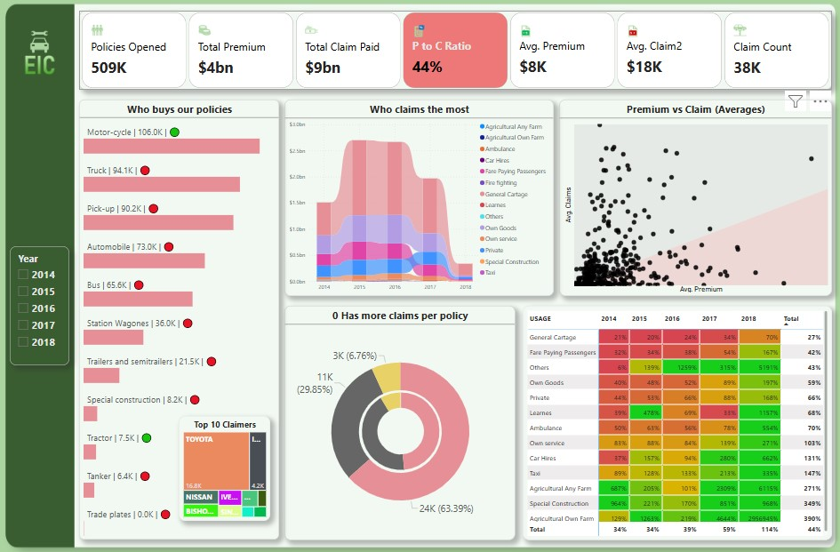

# Motor_Insurance_Analysis_Project
🎯 Project Objective : Between 2014 and 2018, EIC was a prominent player in the motor insurance industry. However, due to consistent underwriting losses, the company ceased operations in 2019.
To understand the root causes of these losses, an in-depth analysis is required to uncover key trends, risk patterns, and operational inefficiencies that may have contributed to the financial downfall.
The objective is to identify actionable insights that could have potentially prevented the losses and provide strategic recommendations for future players in the motor insurance domain to avoid similar pitfalls.

See the report :

Check full dashboard :

Project Process :

1. 

